# ARSW Laboratory 3

**Author:** Daniel Esteban Rodriguez Suarez

## Overview

This laboratory explores different approaches to distributed systems and remote communication in Java. The project starts with a basic TCP solution and progressively evolves into HTTP, RMI, gRPC, and a final gateway that aggregates multiple wellness services.

Each exercise includes:

- A short description of the problem being solved.
- A section describing the implementation approach.
- A section for the required answers, diagrams, or architectural notes.
- A test evidence section where the screenshots from the original README are kept.

## Exercise 1 - TCP Room Reservation Service

### Description

This exercise implements a simple room reservation service using raw TCP sockets. The server receives plain-text commands to consult, reserve, and release rooms.

### Implementation

The solution uses a server socket, one repository with the room state, and a client that sends commands in the expected protocol format. The server processes one request per connection and returns a text response.

### Required Answers / Notes

The TCP protocol is intentionally simple: each request is a comma-separated command such as `CONSULTAR_SALON,E303`. This makes the exercise easy to understand, but it also means that any new operation requires updating both the client and the server so they agree on the same convention.

If two clients try to reserve the same room at the same time, the server must validate the room state before updating it. In this implementation, the request handling is synchronized, so only one reservation can succeed and the other request will fail because the room is already reserved.

The communication contract is defined by convention in the text protocol and in the code, not by a formal schema file. That is one of the main limitations of the TCP version.

### Tests

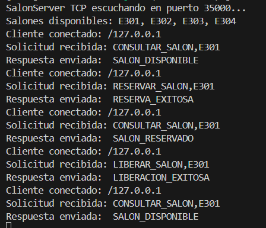

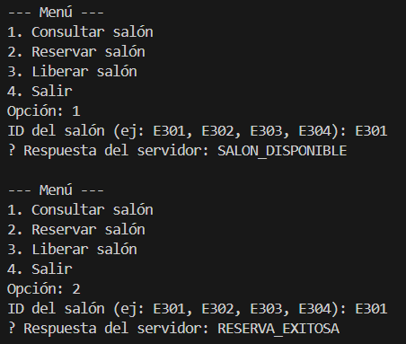

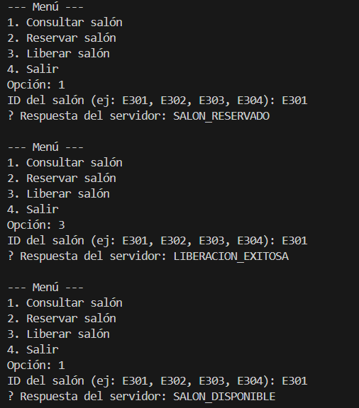

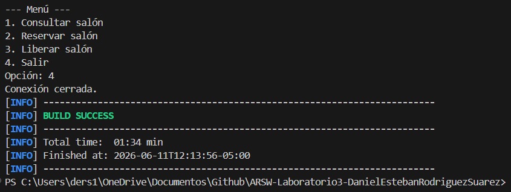

## Exercise 2 - HTTP Room Reservation Service

### Description

This exercise exposes the room reservation functionality through an HTTP server. The service provides endpoints to list rooms, consult a room, reserve a room, and release a room.

### Implementation

The HTTP version reuses the room repository and maps the operations to REST-style endpoints using the built-in `HttpServer` API and a custom request handler.

### Required Answers / Notes

HTTP offers a standard way to expose the same functionality through clear routes and methods. Compared with the TCP version, it is easier to test with a browser, `curl`, or Postman, and the contract is more interoperable because it follows common web conventions.

The endpoints map directly to the reservation operations: `GET /rooms` lists the rooms, `GET /rooms?id=E303` consults one room, `POST /rooms/reserve?id=E303` reserves it, and `POST /rooms/release?id=E303` releases it.

Because this version is built without a framework, routing, query parsing, response formatting, and status handling must be implemented manually. If JSON were used instead of HTML or plain text, the responses would be easier to consume from automated clients and front-end applications.

### Tests

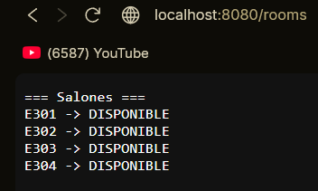

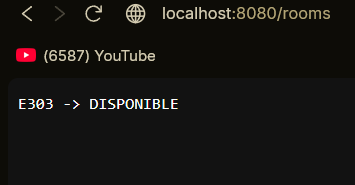

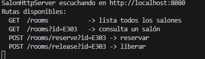

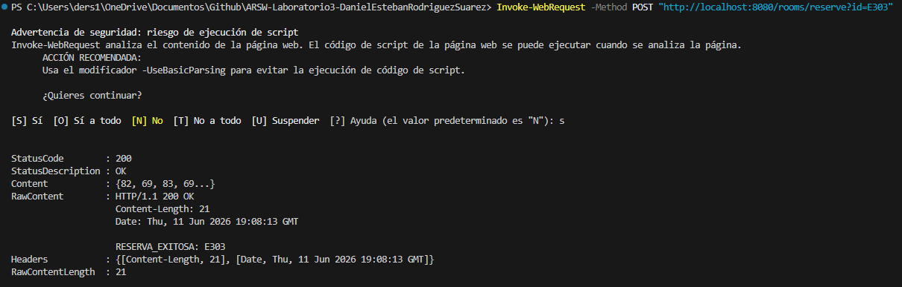

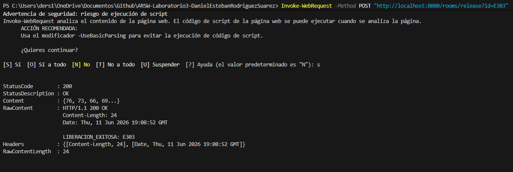

## Exercise 3 - RMI Laboratory Reservation Service

### Description

This exercise implements a remote laboratory reservation system using Java RMI. Clients interact with a remote interface to reserve, consult, and release laboratory equipment or resources.

### Implementation

The solution defines a remote service interface, a service implementation exported through the RMI registry, and a client that communicates with the remote object. The repository stores the reservation state in memory.

### Required Answers / Notes

RMI replaces text-based requests with remote method invocation, which makes the communication feel closer to a local Java call. The contract is defined by the remote interface and its method signatures, so the client and server must both implement the same interface.

The registry-based flow is simple: the server publishes the remote object under a name, and the client performs a lookup to obtain the reference. After that, the client invokes methods such as `consultarEquipo` or `reservarEquipo` directly on the remote stub.

RMI is strongly tied to Java, so a non-Java client would not integrate naturally with this design. That is one of the reasons why RMI is useful conceptually, but less flexible than modern contract-based approaches.

### Tests

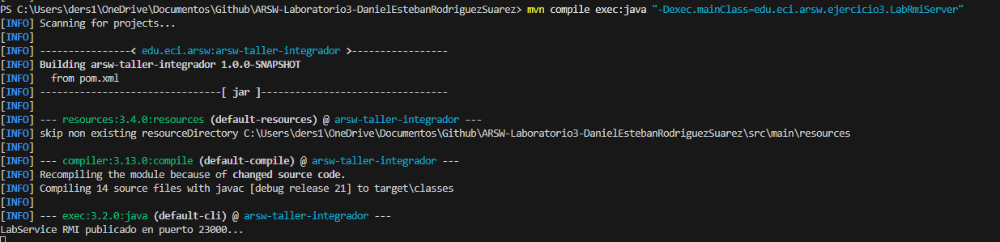

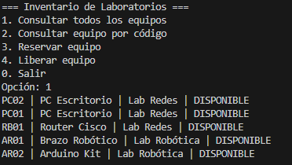

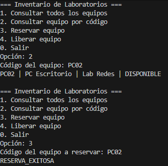

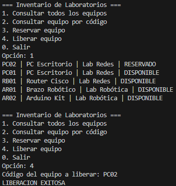

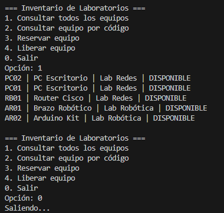

## Exercise 4 - gRPC Appointment Service

### Description

This exercise exposes an appointment management service with gRPC. The service allows students to request appointments and query the appointments already registered.

### Implementation

The service is implemented with protocol buffers, a gRPC server, and a gRPC client. The server publishes the appointment service on port `50051` and uses generated protobuf classes to exchange strongly typed messages.

### Required Answers / Notes

The `.proto` file is the contract because it defines the service methods, request and response messages, field numbers, and data types. From that file, both the client and the server generate strongly typed code, which keeps both sides aligned.

Creating a client in another language is relatively easy as long as that language has gRPC and Protocol Buffers support. The implementation details change, but the contract remains the same.

Compared with RMI, gRPC is language-neutral, explicit, and better suited for distributed systems. RMI depends on Java serialization and the Java ecosystem, while gRPC uses a portable schema and generated stubs.

### Tests

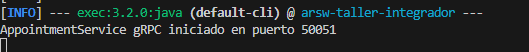

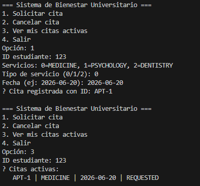

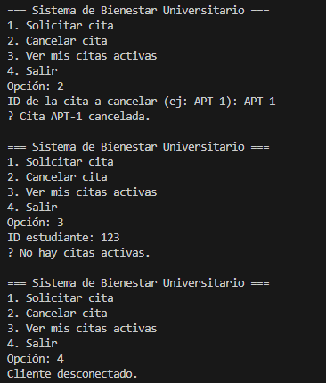

## Exercise 5 - Wellness gRPC Microservices

### Description

This exercise implements a wellness platform composed of multiple gRPC services. It includes appointment management plus additional services for medical specialties, gym sessions, and recreation resources.

### Microservice Diagram

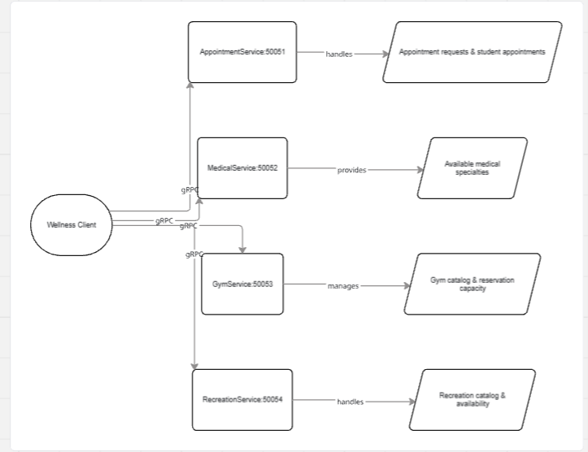

### Implementation

Each domain service runs as an independent gRPC server with its own port and in-memory data model. A client aggregates the available services and interacts with them through generated stubs.

### Required Answers / Notes

The system is split by responsibility into small services:

- `AppointmentService` manages appointment creation, cancellation, and per-student appointment queries.
- `MedicalService` manages the catalog of medical specialties and their availability.
- `GymService` manages gym sessions, their capacity, and reservation counters.
- `RecreationService` manages recreational resources and whether they are available for reservation.

Each service owns its own in-memory data, so there is no shared database or shared state between services. That separation keeps the services cohesive and makes each one easier to understand and replace.

The main risk is client coupling. If the client knows every service and every port, changes in the architecture become more expensive. That is exactly the problem the gateway solves in the next exercise.

### Tests


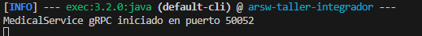

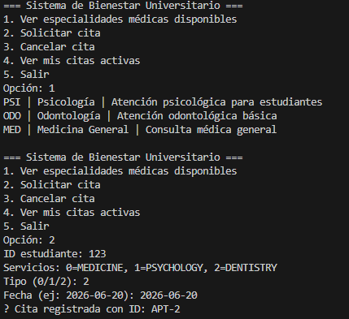


## Exercise 6 - Wellness Gateway

### Description

This exercise adds a gateway that coordinates the wellness services exposed in the previous exercise. The gateway acts as a console entry point that consumes multiple gRPC services and offers a single interaction surface.

### Implementation

The gateway creates gRPC channels to the appointment, medical, gym, and recreation services and uses blocking stubs to request data or perform reservations from one console menu.

### Required Answers / Notes

The gateway simplifies the client by providing a single console entry point that hides the internal ports and direct service calls. In this implementation, it creates gRPC channels to the appointment, medical, gym, and recreation services and orchestrates the user flow from one place.

The gateway adds a new layer of orchestration, which is useful because it centralizes access, but it also adds complexity and can become a bottleneck if too much business logic is moved into it.

In this project, the gateway exposes operations such as requesting an appointment, checking a student wellness summary, reserving a gym session, and reserving a recreation resource.

### Tests

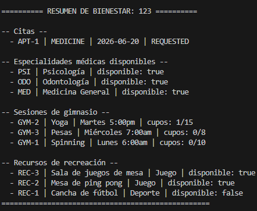

## How to Run

The project uses Java 21 and Maven. From the repository root, compile everything with:

```bash
mvn clean compile
```

You can also run a specific class with `mvn exec:java` or by launching the compiled class from `target/classes`.

### Exercise 1

Start the TCP server:

```bash
mvn exec:java -Dexec.mainClass=edu.eci.arsw.ejercicio1.SalonServer
```

Run the TCP client in a second terminal:

```bash
mvn exec:java -Dexec.mainClass=edu.eci.arsw.ejercicio1.SalonClient
```

### Exercise 2

Start the HTTP server:

```bash
mvn exec:java -Dexec.mainClass=edu.eci.arsw.ejercicio2.SalonHttpServer
```

Then test the endpoints at `http://localhost:8080/rooms`.

### Exercise 3

Start the RMI server:

```bash
mvn exec:java -Dexec.mainClass=edu.eci.arsw.ejercicio3.LabRmiServer
```

Run the RMI client in another terminal:

```bash
mvn exec:java -Dexec.mainClass=edu.eci.arsw.ejercicio3.LabRmiClient
```

### Exercise 4

Start the gRPC appointment server:

```bash
mvn exec:java -Dexec.mainClass=edu.eci.arsw.ejercicio4.AppointmentGrpcServer
```

Then run the client:

```bash
mvn exec:java -Dexec.mainClass=edu.eci.arsw.ejercicio4.AppointmentGrpcClient
```

### Exercise 5

Start the wellness gRPC services in separate terminals:

```bash
mvn exec:java -Dexec.mainClass=edu.eci.arsw.ejercicio5.MedicalGrpcServer
mvn exec:java -Dexec.mainClass=edu.eci.arsw.ejercicio5.GymGrpcServer
mvn exec:java -Dexec.mainClass=edu.eci.arsw.ejercicio5.RecreationGrpcServer
```

Then run the wellness client:

```bash
mvn exec:java -Dexec.mainClass=edu.eci.arsw.ejercicio5.WellnessClient
```

### Exercise 6

Start the services required by the gateway first:

- `edu.eci.arsw.ejercicio4.AppointmentGrpcServer`
- `edu.eci.arsw.ejercicio5.MedicalGrpcServer`
- `edu.eci.arsw.ejercicio5.GymGrpcServer`
- `edu.eci.arsw.ejercicio5.RecreationGrpcServer`

Then run the gateway:

```bash
mvn exec:java -Dexec.mainClass=edu.eci.arsw.ejercicio6.WellnessGateway
```

